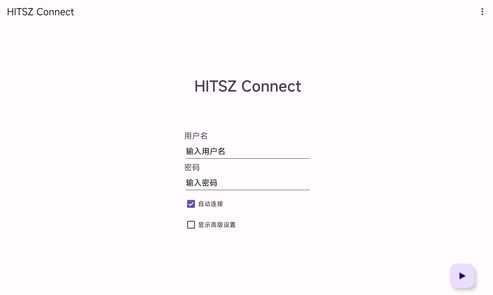

# HITSZ Connect for Android

ZJUConnectForAndroid 的哈工大（深圳）修改版

## 常见问题

Q：为什么一连上就断开？

A：尝试更换输入法，详见 [Issue #1](https://github.com/oldkingOK/HITszConnectForAndroid/issues/1)。

Q：为什么偶尔会断连？

A：由于底层使用的 [zju-connect](https://github.com/Mythologyli/zju-connect) 对于异常包的处理较激进，目前无法解决。

## 感谢

* [Mythologyli/zju-connect](https://github.com/Mythologyli/zju-connect)
* [Mythologyli/ZJUConnectForAndroid](https://github.com/Mythologyli/ZJUConnectForAndroid)
